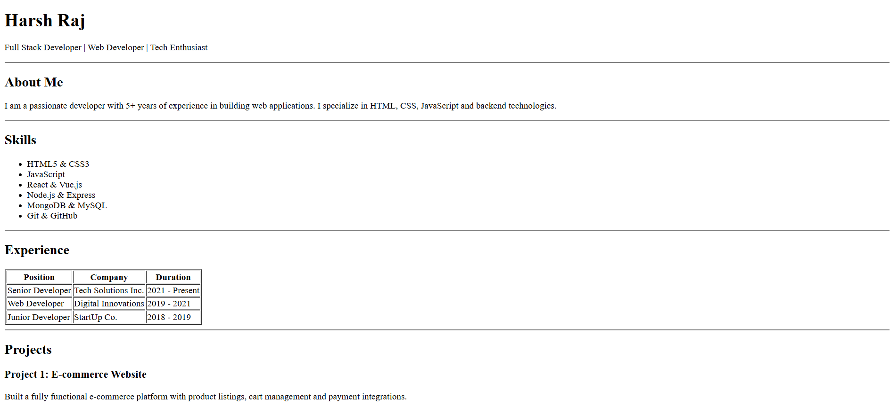
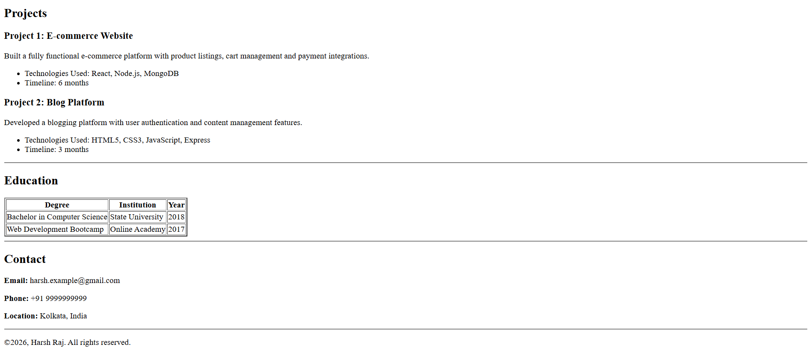

# Live Demo



  
**Live Preview:**  

https://harsh-raj4618.github.io/resume-assign-repo/

# 📄 Personal Resume Website 

This project is a **simple personal resume website** built using **pure HTML5** . It showcases professional information such as **skills, experience, projects, education, and contact details** in a clean and readable layout.

---

## 👤 About the Project

This repository contains the source files for my resume assignment. Follow the instructions below to set up and view the resume locally.

The goals of this project are to:

- Present professional details in a structured format
- Practice semantic HTML
- Serve as a base template for a portfolio or personal website
- Be lightweight, fast, and easy to customize

---

## 🛠️ Technologies Used

- **HTML5**
- Semantic HTML tags
- Tables, lists, and headings for structured content

> ⚠️ **Note:** No CSS or JavaScript is used intentionally to keep the project simple and beginner-friendly.

---

## 📂 Project Structure
```
Resume
├── assets
│   ├── 1.png
│   └── 2.png
├── index.html
└── README.md  
```


---

## ✨ Key Features

- Semantic and accessible HTML layout
- Clear section separation:
  - About
  - Skills
  - Experience
  - Projects
  - Education
  - Contact
- Structured tables for experience and education
- SEO-friendly HTML structure
- Easy to extend with CSS, JavaScript, or frameworks

---


## 🚀 Getting Started

Run Locally

1. **Clone the repository:**
    ```bash
    git clone https://github.com/Harsh-Raj4618/resume-assign-repo.git
    cd your-resume-repo
    ```

2. Open the `index.html` file
3. View it in any modern web browser

```bash
open index.html
```

## Customization

- Update the content in the main file(s) to reflect your experience and skills.
- Modify styles as needed.

## Deployment

You can deploy your resume using GitHub Pages or any static hosting provider.


## 📜 License

This project is open-source and free for personal use.
You are welcome to modify, reuse, and customize it for your own portfolio.

